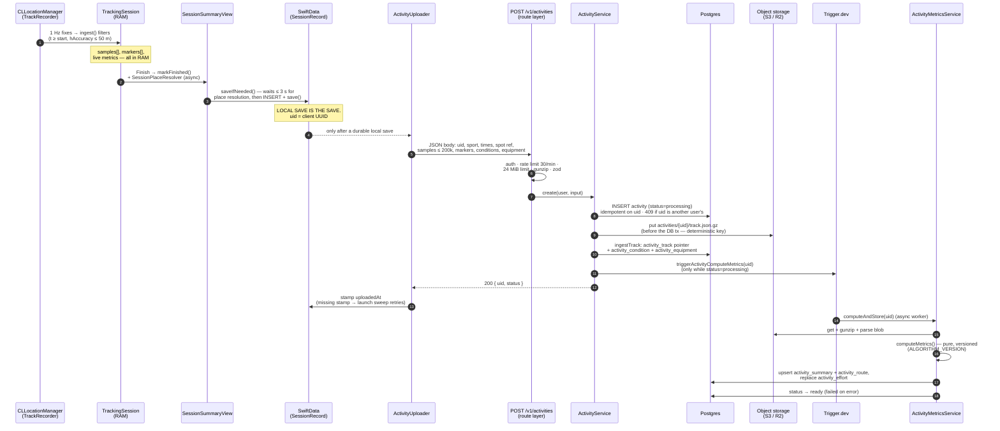
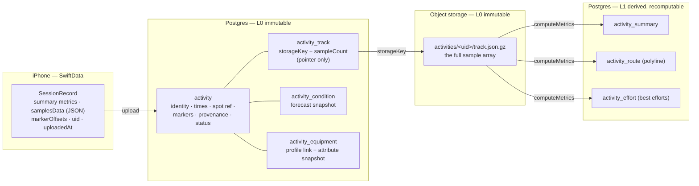

# Activity save flow — from Finish to `ready`

How a finished tracking session travels from the iPhone's memory to durable
storage: the local SwiftData record, the upload, the synchronous ingest
(Postgres + object storage), and the asynchronous metric computation.
Companion to [[activity-data-model]] (the full table design) and RFC-0006
(the contract). Code anchors: `nortada-app-ios` `Features/Track/*`,
`Backend/ActivityUploader.swift`; backend
`src/domains/feature/activity/*`.

## The one-paragraph version

The phone is the source of truth: a session is saved to SwiftData the
moment the summary appears, before any network. The upload is a
fire-and-retry mirror keyed by a client-generated UUID, so resending is a
server-side no-op. The backend splits the write: small, queryable facts go
to Postgres; the raw GPS track goes to S3-compatible object storage as one
immutable gzipped blob, with only a pointer row in the DB. Everything
derived (summary, polyline, best efforts) is computed asynchronously by a
Trigger.dev worker and can always be recomputed from the blob.

## Sequence



## Where each piece of data lands



### iPhone · `SessionRecord` (SwiftData) — written by `SessionSummaryView.saveIfNeeded`

| Field group | Content |
| --- | --- |
| Identity | `uid` (client-generated UUID — the idempotency key), sport, date, `endedAt` |
| Place | `spotName`, `spotUid` (resolved by `SessionPlaceResolver`: explicit start > 100 m track snap > reverse-geocoded name) |
| Metrics | duration, distance, max/avg speed, planing/riding minutes, ≤64-point speed silhouette |
| Wind | the conditions snapshot the user saw at start (forecast reference, not observation) |
| Raw copy | `samplesData` — the full `TrackSample` array as JSON (lets the sweep re-upload after failures) |
| Markers | `markerOffsets` — Mark-button seconds since start |
| Sync state | `uploadedAt` — nil until the server confirms; the launch sweep retries nil rows |

### `activity` (Postgres, L0) — written by `ActivityService.create`

| Column(s) | Value |
| --- | --- |
| `uid`, `user_id` | client UUID + authenticated owner; unique on uid, 409 if owned by someone else |
| `sport`, `source`, `status`, `data_version` | upload fields; status starts `processing`, `dataVersion` 1 (write-once P0) |
| `started_at`, `ended_at`, `timezone` | session time from the client |
| `spot_uid`, `spot_name` | loose ref — no FK into the spot domain |
| `start_lat/lon`, `end_lat/lon` | copied from the first/last sample at ingest |
| `markers` | double[] — Mark offsets (seconds), **sorted by the service** |
| `device`, `device_model`, `os_version`, `app_version` | provenance |
| `custom_name`, `notes`, `feeling`, `tags`, `perceived_effort`, `privacy`, `hide_start`, `hidden_radius_m` | L3 context — empty at ingest, mutated later via PATCH only |

### `activities/<uid>/track.json.gz` (object storage, L0) — written before the DB transaction

The verbatim `samples` array, gzipped: `{ t, lat, lon, speed?, hAccuracy?,
sAccuracy?, course?, cAccuracy? }` per sample, canonical SI. Immutable; the
deterministic key means an upload retry overwrites the identical object,
and a rare orphan (S3 written, DB insert lost) is reclaimed by the next
retry. This blob is the input every recompute reads.

What the gunzipped blob looks like (1 Hz; `t` = seconds since `startedAt`,
`speed` in m/s, accuracies in meters / m/s / degrees, `course` in degrees
from north):

```json
[
  { "t": 0,  "lat": 40.963310, "lon": 29.058640, "speed": 0.4, "hAccuracy": 4.2, "sAccuracy": 0.5,  "course": 84.0,  "cAccuracy": 12.4 },
  { "t": 1,  "lat": 40.963312, "lon": 29.058710, "speed": 5.9, "hAccuracy": 3.8, "sAccuracy": 0.4,  "course": 86.5,  "cAccuracy": 4.1 },
  { "t": 2,  "lat": 40.963309, "lon": 29.058789, "speed": 8.7, "hAccuracy": 3.5, "sAccuracy": 0.3,  "course": 88.2,  "cAccuracy": 2.9 },
  { "t": 3,  "lat": 40.963301, "lon": 29.058874, "hAccuracy": 5.1, "sAccuracy": -1, "cAccuracy": -1 },
  { "t": 4,  "lat": 40.963296, "lon": 29.058961, "speed": 9.2, "hAccuracy": 3.4, "sAccuracy": 0.3,  "course": 91.0,  "cAccuracy": 2.7 }
]
```

Note the honesty convention on sample `t: 3`: an invalid Doppler reading
(CoreLocation `speedAccuracy < 0`) means `speed` and `course` are OMITTED,
never zero-filled — the accuracy fields still ride along so the metric
engine can see why. `computeMetrics` re-guards on read regardless
(`hAccuracy ≤ 25 m`, spike rejection, Doppler corroboration).

### `activity_track` (Postgres, L0) — pointer row

| Column | Value |
| --- | --- |
| `activity_id` | unique — exactly one track per activity |
| `storage_key` | `activities/<uid>/track.json.gz` |
| `sample_count` | array length (cheap existence/size probe without touching S3) |

### `activity_condition` (Postgres, L0) — one row, `kind = forecast`

Only when the start carried live conditions: `wind_speed_ms`,
`wind_gusts_ms`, `wind_direction_deg`, `temperature_c`, `weather_code`,
`captured_at` (= `startedAt`). Observed conditions are a later phase and
will be separate rows (`kind = observed`).

### `activity_equipment` (Postgres, L0) — one row per resolved gear ref

`equipment_profile_id` + `role?` + `snapshot` (the profile's attributes
JSONB **at record time** — editing the profile later never rewrites past
sessions). Unresolved refs are skipped with a log line, never a failed
upload.

### L1 derived — written only by `ActivityMetricsService` (Trigger.dev worker)

| Table | Content | Write mode |
| --- | --- | --- |
| `activity_summary` | totalDistance, max/avg/avgMoving speed, durations, maxDistanceFromStart, validSampleCount, gapCount + `algorithm_version`, `input_data_version`, `computed_at` | upsert |
| `activity_route` | encoded polyline + `algorithm_version`, `computed_at` | upsert |
| `activity_effort` | one row per best effort (time/distance variants): result, duration, distance, start offset + versioning | replace all |

The worker flips `activity.status` to `ready` on success, `failed` on
error. Because L0 never changes, bumping `ALGORITHM_VERSION` makes every
L1 row recomputable from the blob.

## Failure and retry semantics

- **Local save fails** → the in-memory record still backs the summary UI;
  nothing uploads (no durable copy, no mirror).
- **Upload fails** → `uploadedAt` stays nil; the app-launch sweep resends.
  Same uid → the server returns the existing row untouched.
- **Retry after full ingest** → `trackExists` short-circuits: no S3 write,
  no duplicate condition/equipment rows; re-enqueues metrics only if the
  activity is still `processing` (recovers a lost enqueue without
  re-processing `ready` or retrying `failed`).
- **S3 written but DB insert lost** → orphaned object, reclaimed on retry
  (deterministic key).
- **Delete** → local SwiftData delete + best-effort server DELETE (a 404
  for a never-uploaded uid is fine).

## Read paths (for completeness)

- `GET /v1/activities` — lean list DTO: identity + `spotName` + nullable
  summary. No markers, no track.
- `GET /v1/activities/:uid` — detail assembled from four parallel
  repository reads: activity fields + summary + polyline + markers +
  efforts + conditions. The raw blob is never served to clients; the
  phone renders its own local copy.
